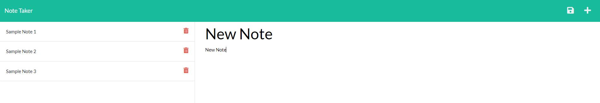

# Pro-Notes Deluxe

## Description
A Heroku-hosted app with a straightforward interface that allows the user to create, save, and delete text notes. Pro-Notes Deluxe is great for saving reminders, appointment information, shopping lists, and more!

## **Table of Contents**
* [Screenshot](#screenshot)
* [Website](#website)
* [Usage](#usage)
* [Programs](#programs)
* [Questions](#questions)

## **Screenshot**

## **Website**
[Pro-Notes Deluxe](https://pro-notes-deluxe.herokuapp.com/)

## **Usage**
1. On the homepage, click the 'Get Started' button
2. On the notes page, click the "+" symbol in the top right corner to create a new note
3. After you give your new note a title and text, click the save icon next to the "+"
4. View all of your saved notes in the left-side column
5. To delete a saved note, click the trash icon

## **Programs**
* JavaScript
* Node.js
* Express.js
* Heroku

## **Questions**
Please contact me directly with any additional questions:
* [GitHub](https://github.com/ChristopherLawn)
* [Email](mailto:christopher.lawn@yahoo.com)